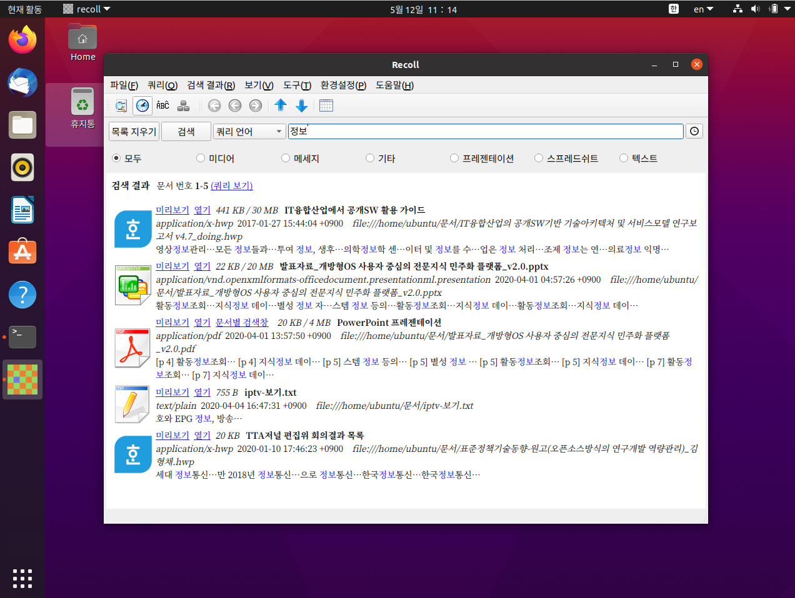
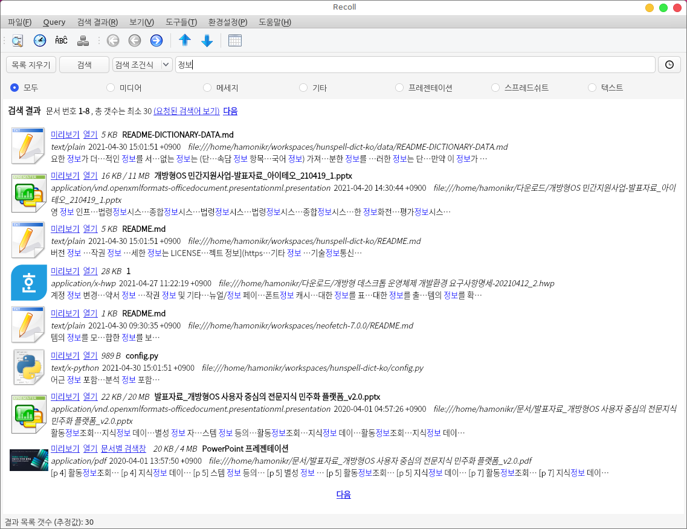
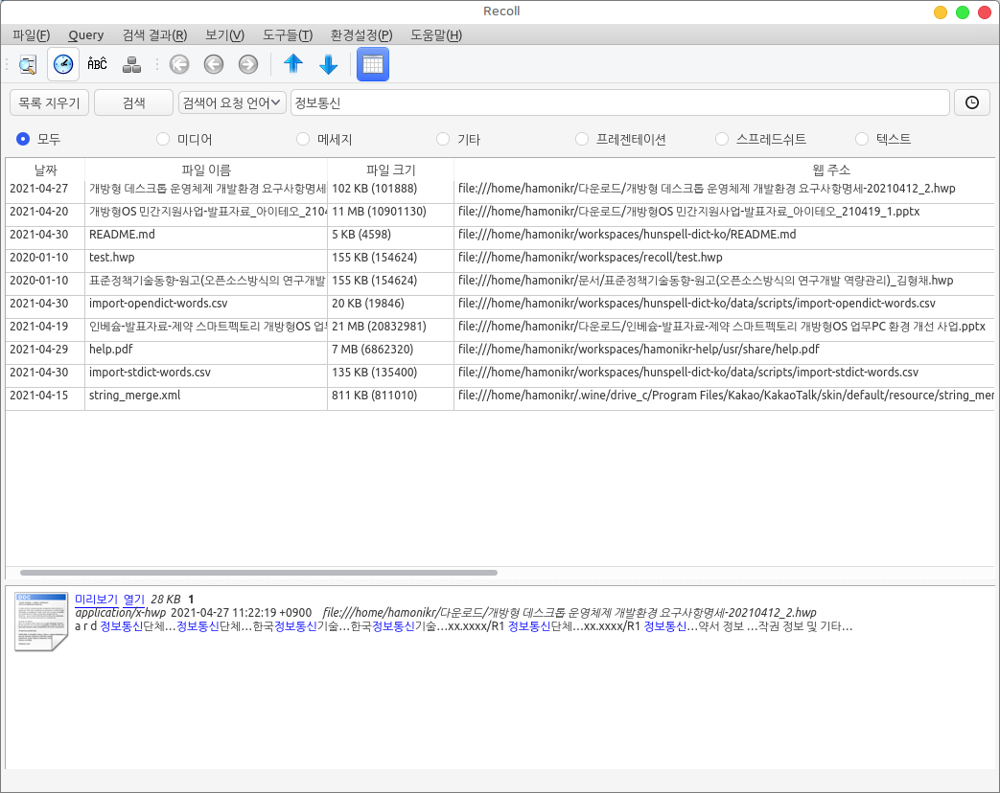

# recoll

데스크톱 원문 검색 프로그램

Desktop full-text search tool.
 * ppt, doc, xls, pdf 등 원문검색 지원
 * hwp 문서 형식 원문검색 지원

origin : https://www.lesbonscomptes.com/recoll/







# Install

## HamoniKR (>= 4.0)
```
sudo apt update
sudo apt install -y recoll=1.31.0-1hamonikr5
```

## Ubuntu (>= 20.04)
```
curl -sL https://pkg.hamonikr.org/add-hamonikr.apt | sudo -E bash -

sudo apt install -y recoll=1.31.0-1hamonikr6
```

## How to build from source for othrt linux

### Install build dependencies

```
sudo apt install -y bison debhelper dh-python dpkg-dev libaspell-dev libchm-dev libqt5webkit5-dev libx11-dev libxapian-dev libxslt1-dev libz-dev python3-all-dev python3-setuptools qtbase5-dev python3-pip qttools5-dev-tools docbook-xsl

```
### Build from source

```
sudo apt install -y python3-pip
sudo pip3 install pyhwp

./configure
make
sudo make install
```

## How to build debian package
```
dpkg-buildpackage -T clean
dpkg-buildpackage

dpkg -i ../recoll*.deb
```
